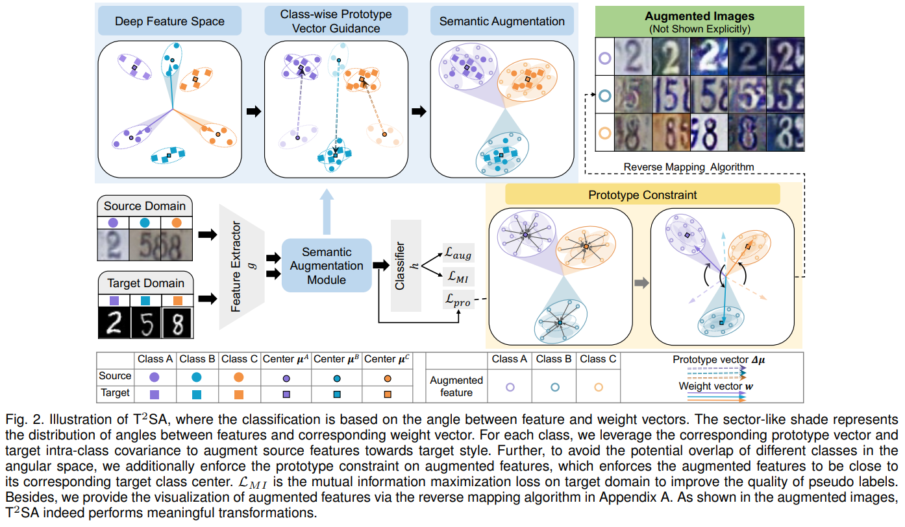

#Target-oriented Transferable Semantic Augmentation (TTSA)

Pytorch Implementation for TPAMI manuscript "Adapting Across Domains via Target-oriented Transferable Semantic Augmentation under Prototype Constraint"

## Abstract

We present a Target-oriented
Transferable Semantic Augmentation (TTSA) method, which enhances the generalization ability of the classifier by training it with a
target-like augmented domain, constructed by semantically augmenting source data towards target at the feature level. Moreover, we
achieve the augmentation implicitly by minimizing the upper bound of the expected Angular-softmax loss over the augmented domain,
which is of high efficiency. Additionally, to further ensure that the augmented domain can imitate target domain nicely and
discriminatively, the prototype constraint is enforced on augmented features class-wisely, which minimizes the expected distance
between augmented features and corresponding target prototype (i.e., average representation) in Euclidean space.

<div align=center></div>

## Prerequisites
The code is implemented with **CUDA 11.2**, **Python 3.7**.

To install the required python packages, run

```pip install -r requirements.txt```

## Datasets

### Office-31
Office-31 dataset can be found [here](https://people.eecs.berkeley.edu/~jhoffman/domainadapt/).

### Office-Home
Office-Home dataset can be found [here](http://hemanthdv.org/OfficeHome-Dataset/).

### VisDA 2017

VisDA 2017 dataset can be found [here](https://github.com/VisionLearningGroup/taskcv-2017-public).

### DomainNet

DomainNet dataset can be found [here](https://github.com/VisionLearningGroup/taskcv-2017-public).


## Running the code

unsupervised domain adaptation (UDA)
```
python3 train_TSA.py --gpu_id 4 --arch resnet50 --seed 1 --dset office --output_dir log/office31 --s_dset_path data/list/office/webcam_31.txt --t_dset_path data/list/office/amazon_31.txt --epochs 40 --iters-per-epoch 500 --lambda0 0.25 --MI 0.1

```

multi-source domain adaptation (MSDA)
```
python3 train_TSA.py --gpu_id 4 --arch resnet50 --seed 0 --dset office-home --output_dir log/office-home --s_dset_path data/list/home/Art_65.txt --t_dset_path data/list/home/Product_65.txt --epochs 40 --iters-per-epoch 500 --lambda0 0.25 --MI 0.1
```

domain generalization (DG)
```
python3 train_TSA.py --gpu_id 4 --arch resnet101 --seed 2 --dset visda --output_dir log/visda --s_dset_path data/list/visda2017/synthetic_12.txt --t_dset_path data/list/visda2017/real_12.txt --epochs 30 --iters-per-epoch 1000 --lambda0 0.25 --MI 0.1
```

## Acknowledgements
Some codes are adapted from [ISDA](https://github.com/blackfeather-wang/ISDA-for-Deep-Networks) and 
[Transfer-Learning-Library](https://github.com/thuml/Transfer-Learning-Library). We thank them for their excellent projects.

## Contact
If you have any problem about our code, feel free to contact
- shuangli@bit.edu.cn
- michellexie102@gmail.com
- kxgong@bit.edu.cn

or describe your problem in Issues.
